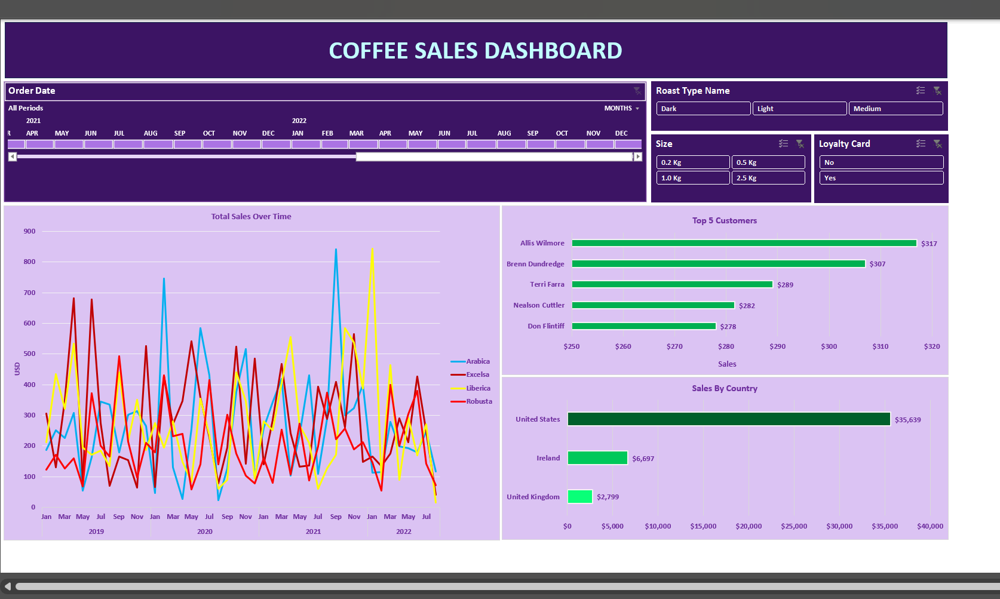
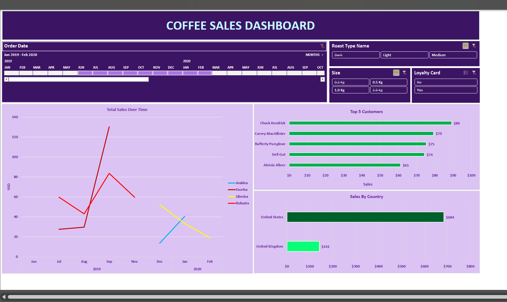

# Coffee_Orders_Analysis

## Project Overview
This Excel project analyzes coffee sales data to provide insights into sales trends, top customer, and overall performance. The data is presented through an interactive dashboard that offers a clear and concise view of key metrics.

## Features
- **Sales Analysis:** Breakdown of sales by country, product type, quantity and time period.
- **Customer Insights:** Analysis of customer demographics and purchasing patterns.
- **Interactive Dashboard:** A visually appealing dashboard with charts and graphs for quick data interpretation.

## Dashboard Screenshot

## Usage
1. Download the `coffeeOrdersProject.xlsx` file.
2. Open it in Excel to explore the sales data and the interactive dashboard.

## Purpose
This project is designed to showcase Excel's data analysis capabilities and the effective use of dashboards for business insights.

## Author
Manisha

